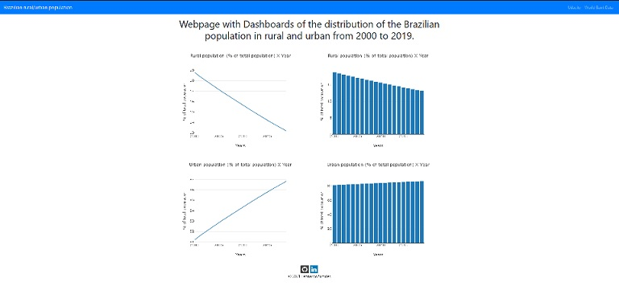

# Udacity - Data dashboard with worldbank data 
Project of the Udacity Machine Learning Engineer Nanodegree Program.

Webpage with Dashboards of the distribution of the Brazilian population in rural and urban from 2000 to 2019.

## Programming technologies used 
- Python
- Pandas
- Flask
- Jinja
- Plotly
- Bootstrap

## Result

## References
UDACITY - Machine Learning Engineer Nanodegree: https://www.udacity.com/course/machine-learning-engineer-nanodegree--nd009t
